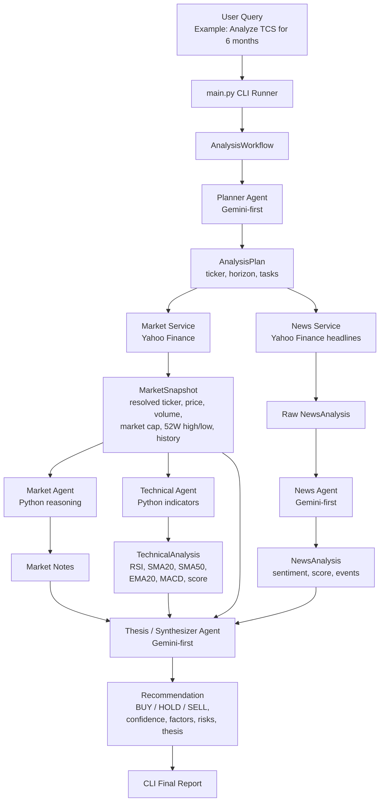
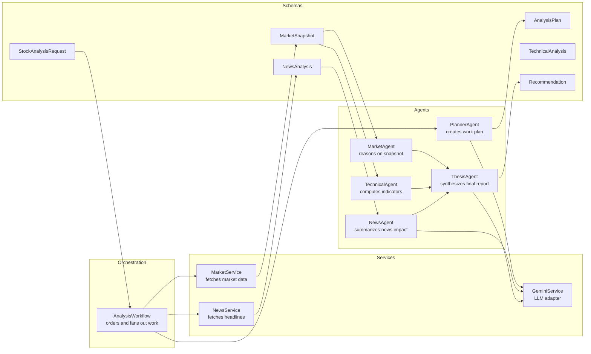
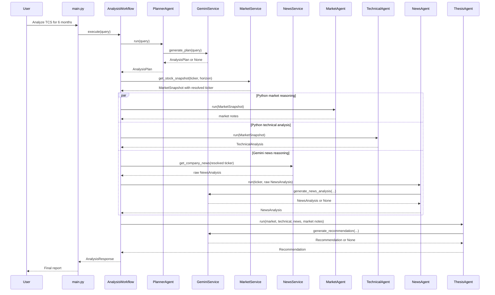

# Stock Market Analyser Architecture Flow

This file shows how the current agentic architecture works end to end.

## High-Level Flow



## Core Rule

```text
Agents reason.
Services fetch.
Schemas define what can be passed.
Workflow coordinates.
```

Agents never call Yahoo Finance directly. External data access stays inside services.

## Component Responsibilities



## Runtime Sequence



## Fallback Behavior

Gemini is used first for:

- planning
- news interpretation
- thesis synthesis

If Gemini is unavailable or returns invalid JSON, the app falls back to deterministic logic so the local workflow can still run and tests remain stable.

## Example CLI Output

```text
Ticker: TCS
Resolved Market Ticker: TCS.NS
Horizon: 6_months
Recommendation: SELL
Confidence: 5%

Bullish:
- RSI is in a healthy range

Bearish:
- Price is below 20 DMA
- Price is below 50 DMA
- MACD is below signal line

News Sentiment: neutral (50%)

Risks:
- Market volatility can invalidate short-term signals.
```
